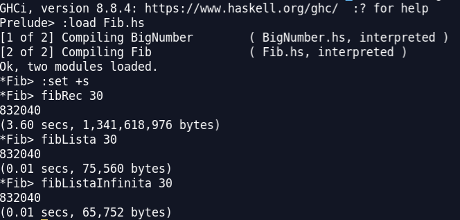
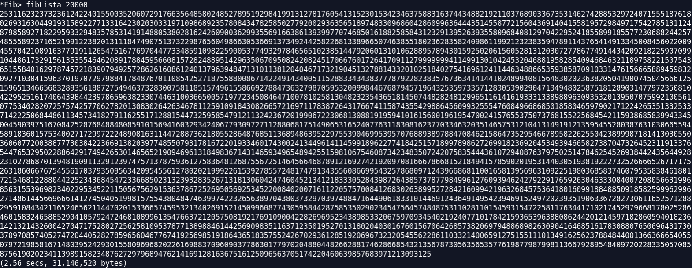
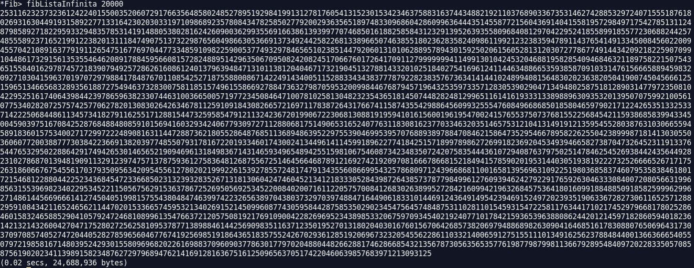
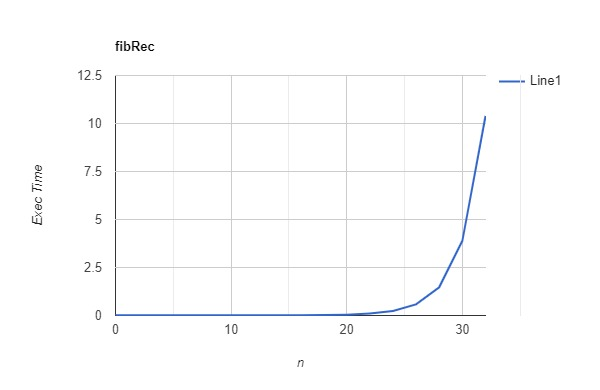
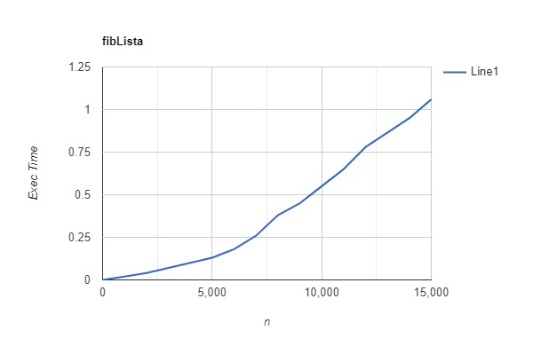
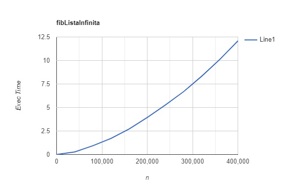
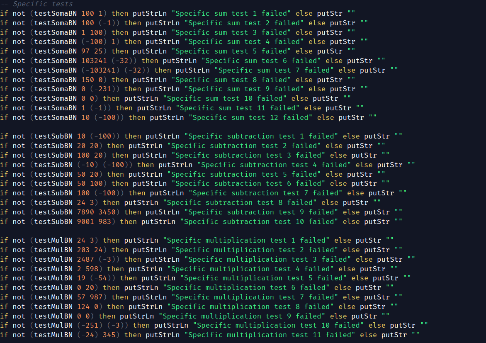
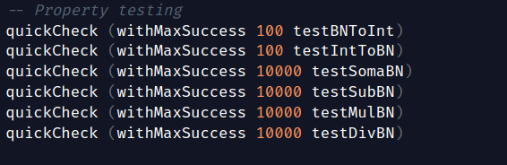
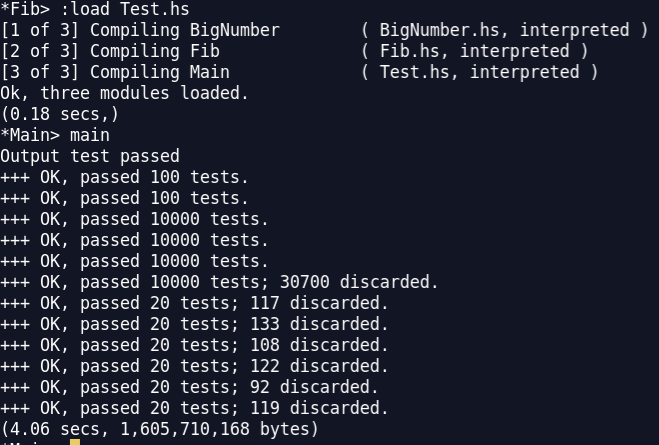

# **PFL PROJECT** 

## **Project Description**

For this project, we were asked to:
- develop a set of functions to calculate the nth value of the fibonacci sequence using differente techniques
- develop a module containing a new type called BigNumber and functions to associate it with. This new type's goal is to represent numbers as list, in order to make possible the representation of numbers without limitations of size

## **Function Description**

> **Note:** The time complexities described below are only rough estimates, as it is difficult to deduct given the number of prelude functions and operations with unknown or hard to picture costs and the unknown charachter of haskell's internal optimizations

### **BigNumber**

BigNumbers are essentially numbers represented as lists, so to detach numbers from size limitations imposed by memory.
We defined this type via the expression *data*, which enabled us to separate them into Positive (Pos) Negative (Neg) and Zero.

#### **Main Functions**

- **somaBN**
    - **Description:**
        - This function implements the sum of two BigNumbers
        - This is accomplished by implementing the same technique learned in primary school to execute the sum of two numbers digit by digit
        - First, the function divides the cases analyzing the signal of the numbers involved, utilizing properties of the sum and arithmetic expressions such as the fact that Pos - Neg = Pos + Pos and Pos + Neg = Pos - Pos
        - Afterwards, calculations are perfomed, taking only the lists as arguments: the sum of the rightmost digits is executed and the carry (value that exceeds in the decimal case) is passed on to the next call
        - This process is repeated recursively until there is no more carry and one of the lists of digits has ended
    - **Time Complexity: O(N)**
        - N being the length of the list representing the biggest number, the sum of two digits (supposedly O(1)) is performed at most N times
        - Ence, O(N) * O(1) = O(N)
    - **Space Complexity: O(1)**
        - Only some variables are required to maintain the carry of the sums
- **subBN**
    - **Description:**
        - This function implements the subtraction between two BigNumbers
        - This is accomplished by implementing the same technique learned in primary school to execute the subtraction of two numbers digit by digit
        - First, the function divides the cases analyzing the signal of the numbers involved, utilizing properties of the subtraction and arithmetic expressions such as the fact that Pos - Neg = Pos + Pos and Pos + Neg = Pos - Pos
        - For the classical subtraction case (same signal), the output can be predicted to be Negative, Positive or Zero by comparing the lists which represent the number
        - Afterwards, calculations are performed, taking only the lists as arguments: the procedure is simillar to the sum, basing itself on digit by digit subtractions and the use of a carry
        - To clean up the list of digits of possible zeros in the beggining, a dropWhile is used
        - The end conditions are also the same as for the sum
    - **Time Complexity: O(N)**
        - N being the length of the list representing the biggest  number, the subtraction of two digits (supposedly O(1)) is performed at most N times
        - The operation of comparing the two lists to determine the nature of the output costs, in the worst scenario, O(N)
        - O(N) * O(1) + O(N) = 2 * O(N) = O(N)
    - **Space Complexity: O(1)**
        - Only some variables are required to maintain the carries in the digit operations
- **mulBN**
    - **Description:**
        - This function implements the multiplication of two BigNumbers
        - This is accomplished by implementing the same technique learned in primary school to execute the multiplication of two numbers digit by digit
        - First, the function divides the cases analyzing the signal of the numbers involved, utilizing properties of the multiplication and arithmetic expressions such as the fact that Pos * Neg = Neg and Anythin * Zero = Zero
        - For the calculations themselves, only the lists with digits are involved
        - The technique bases itself on multiplying the whole first number by each digit of the second number and summing the result
        - Each list arising from a multiplication between a digit and its elements, a left shift is executed, so to implement the different orders of magnitude of the digits in the second list
        - This technique is accomplished through the use of two auxiliary functions that apply recursion to achieve repetition:     
            - one to execute the first step of multiplying
            - another to perform a shift to the first number and apply the sum to the results
        - Previously, another strategy was used, similay to the one applied to the division, but after some testing it was substituted due to the difference in performance
    - **Time Complexity: O(N * M)**
        - N and M being the sizes of the lists of the first and second BigNumbers respectively, the multiplication between two digits is going to be performed N * M times
    - **Time Complexity: O(1)**
        - Time complexity remains constant for the same reasons

- **divBN**
    - **Description:**
        - This functions implements the division between two BigNumbers, returning a tuple with the quocient and the remainder
        - This time, the conventional way won't help us, as it is too unreliable for big divisors
        - Instead, we used a slow division method aproach
        - Firstly, the signal of the result is asserted, as it was for the other functions, even if this time it is less relevant as divisions involving negative numbers result in unexpected results
        - Once again, for the calculations themselves, only the lists of digits are necessary. This time, the result is calculated by recursively calling a function which subtracts the the divisor to the dividend until it becomes smaller than it
    - **Time Complexity: O(N²/M)**
        - This function performs subBN N/M times, being N the value of the dividend and M the value of the divisor
        - Ence, O(N) * O(N / M) = O(N²/M)
    - **Space Complexity: O(1)**
        - Once again, no auxiliary structures needed
 
#### **Auxiliary Functions**

- **intToBN** **intToList** **bnToInt** **listToInt**
    - Convertion functions necessary to implement property testing
- **symmetricBN**
    - Function used in subBN to return the symmetric of a BigNumber, **time complexity** is O(1)
- **compareBN** 
    - Function used in subBN to compare two lists representing bigNumbers, **time complexity** is O(N) in worst scenario
- **finiteListGenBN** and **infinitListGenBN**
    - Used for the BigNumber version of the fibonacci functions, generate finite and infinit lists of BigNumbers respectively, **time complexity** is O(N), N being the length of the lists (for the infinit, the length needed)
- **indexListBN**
    - Used for the BigNumber version of the fibonacci functions, accesses a certain index of a list of BigNumbers using a BigNumber index, **time complexity** is O(I), I being the value of the index

> **Note:** All these functions make use of subBN and somaBN which are O(N) themselves. They are used in a best case scenario situation (sum and subtraction with and by 1), which makes them O(1)

### **Fibonacci**

This module contains functions capable of calculating the nth element of the fibonacci sequence in different ways

- **fibRec**
    - **Description:**
        - Basic recursive formula for the fibonnaci sequence. The function calculates the value of the fibonacci sequence's nth element by recursively calculating the values of the previous two elements and summing them.
    - **Time Complexity: O(2^N * N) for Integer, O(2^N) for Int** 
        - T(N) = T(N - 1) + T(N - 2) + N, as deductable by the formula of the function (N as the cost of the sum of integers, for Int it would be 1 supposedly)
        - T(N - 1) ≈ T(N - 2)
        - T(N) = 2 * T(N - 1) + N
        - T(N) = 2 * [2 * T(N-2) + N] + N = 4 * T(N-2) + 3N
        - T(N) = 2^k * T(N–k) + 2^k*N - 1
        - As T(0) = 1, N - k = 0 => N = k
        - Finally, T(N) = 2^N + T(0) + 2^N*N - 1 = 2 * 2^N * N = 2^N * N
        - For Ints, the '+ N' in the beggining would be '+ 1', making it O(2^N)
    - **Space Complexity: O(1)**
        - The algorithm does not require any extra data structures
- **fibLista**
    - **Description:**
        - This function uses dynamic programming by saving the values of already calculated elements in a list, so to avoid the repetition of an operation. This technique of saving values that are expected to be needed later is called *Memoization*. 
        - The function will calculate the values of the numbers through a recursive list comprehension, where each element is equal to the sum of the previous two elements in the list. 
        - This technique inccurs in a drastic reduction of the calculations needed and therefore a major increase in speed
    - **Time Complexity: O(N²) for Integer, O(N) for Int**
        - The time complexity of the algorithm is expected to be quadratic as the cost is basically the cost of the sum operation times the length of the list (number of times this operation is performed), ence O(N*N) = O(N²) for Integers (sum is predicted to be O(N)) and O(N) for Ints
    - **Space Complexity: O(N)**
        - List of size N is required for this algorithm

- **fibListaInfinita**
    - **Description:**
    - This function uses infinit lists to take advantage of haskell's lazyness
    - The list is incrementally calculated by summing itself to its tail using zipWith function (zipWith applies a certain function with two arguments to the elements of two lists)
    - This leads to a simillar strategy as the last function but implementing lazyness
    - This means haskell will only calculate the list until the element it is trying to access is defined
    - **Time Complexity: O(N²) for Integer, O(N) for Int**
        - Although the time of execution is much faster than the alternative before (again, hard to predict this behaviour because of haskell's internal optimizations), the time complexity of the algorithms should be the same
    - **Space Complexity: O(N)**
        - List of size N is required for this algorithm

- **fibBigNumber variants** 
    - The formulas of these functions are essentially the same as the ones described before but implementing the BigNumber type and its operations
    - Overall they are expected to be a bit slower but the principles behind the functions used for the BigNumbers should not stray too far from the ones used in the implementation of Integers

## **Data Comparison** 

While testing the Fibonacci sequence functions, we found that the best data type to use may differ with the circumstances, so we will compare these functions with 3 different types (**Int**, **Integer**, **BigNumber**).

- **Small to Medium Numbers**
    - For numbers within the range allowed for **Int**, they prove to be the best choice, since the efficiency of the algorithms is greater
    - This can be explained by the fact that both Integer and BigNumber require more complex operations to sum and subtract numbers due to their boundless nature
- **Big Numbers**
    - From the moment the result of the fibonacci functions surpasses the bounds of **Int** type (-9223372036854775808 to 9223372036854775807), the best choice would be the **Integer**
    - The BigNumber implemented in this project works fine for this case, only presenting lower efficiency

In general, while **Int** is more efficient than the others due to it's implementation, it is naturally limited, and so, not suited to use in bigger ranges.

The main difference between **Integer** and **BigNumber** is their implementation. **Integer** is a built-in data type so it's expected to be more efficiently built than our **BigNumber**.

> **Note:** Int and Integer were tested by defining a variable of that type to save the result of the function and then comparing the results.

## **Fib Functions Comparison**

For this project, we implemented three different functions to calculate the nth element of the fibonacci's sequence:
- Pure recursion (fibRec)
- Dynamic programming using list (fibLista)
- Using haskells infinit lists and lazy evaluation (fibListaInfinita)

As expected, their efficiency increases from first to last.

>  
> 
>  
> 
>  

### **Table comparison**

 N | fibRec | fibLista | fibListaInfinita
-------|--------|----------|------------------
10 | 0.01s | 0.00s | 0.00s 
20 | 0.03s | 0.00s | 0.00s
30 | 3.52s | 0.01s | 0.01s
1000 | - | 0.01s | 0.01s
5000 | - | 0.14s | 0.02s
10000 | - | 0.45s | 0.02s
20000 | - | 3.11s | 0.04s

### **Graphical comparison**
fibRec | fibLista | fibListaInfinita
-------|----------|-----------------
 |  | 

> **Note:** Graphics were made in a differente compute, ence slightly different values; Graphs do not reflect O(N) precisely due to small sample sizes

## **Testing**

Testing of our functions was made in two ways:
- Property testing using QuickCheck
- Manual testing to ensure some edgier cases were treated of

Tests are defined in Test.hs and can be run by loading the file and running the main function

#### **Prints of some functions, their calls, and the results of the tests**

> 
> 
> 
> 
> 

## **Authors**

|Name | e-mail | Group|
|:-----:|:-------:|:----:|
Marcelo Couto | up201906086@edu.fe.up.pt | G9_09
José Silva | up201904775@edu.fe.up.pt| G9_09

**Final Grade** - 18.8